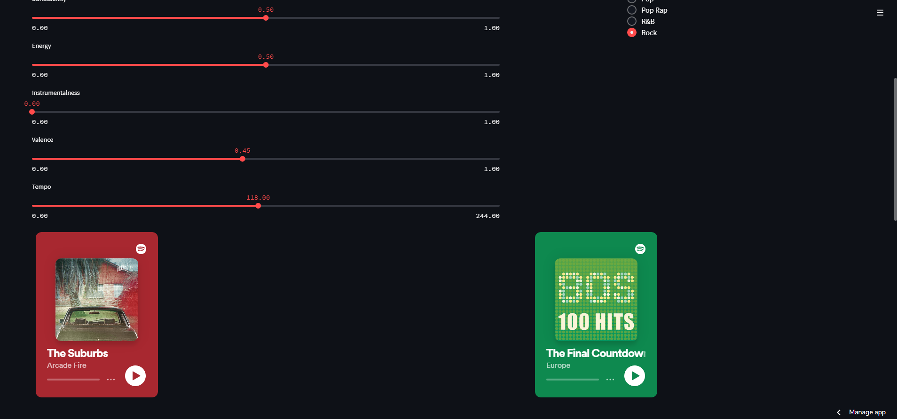

# ReactMovieApp || Reactjs || Recommendation System for Movies and Music

Aplikasi Film Sederhana menggunakan React JS, memungkinkan pengguna untuk mencari dan memfilter film yang mereka inginkan

Untuk pembuatan UI, HTML5 dan CSS3 dan material-UI digunakan ini adalah aplikasi web responsif untuk dilihat di Mobile dan Desktop.

Selain itu juga terdapat aplikasi yang sudah di deploy ke aplikasi mobile baik untuk Android maupun IOS.

## Demo

Lihat demo langsung dan coba sendiri: [demo](https://seiyuops.web.app/)

<!-- # ScreenShots -->

## Halaman Awal
   <kbd>
   </kbd><kbd></kbd>
   
  ## Jalankan perintah berikut:
 Instruksi ini akan memberi Anda salinan proyek dan berjalan di mesin lokal Anda untuk tujuan pengembangan dan pengujian.
### Langkah 1: clone the repository
     git clone https://github.com/siabang35/Movie-Music.git
### Langkah 2: navigate to the clone 
     cd path_kamu/React-Movie-App 
#### Langkah 3: Install Node.js, dengan cara:
     npm install        
#### Langkah 4: Set your api key environment variable(.env). ambil api key dari  [TheMovieDb](https://www.themoviedb.org/)
     REACT_APP_API_KEY=your_api_key
#### Langkah 5:
     npm  start  

## Halaman Rekomendasi Movie
 <kbd></kbd>
 <kbd></kbd>

## Halaman Rekomendasi Music
 <kbd></kbd>
 <kbd></kbd>
   ##
Copyright (c) 2022 Seiyū Ops

<!-- 
 
      <kbd> </kbd>  
      <kbd></kbd>

 -->
  

 

<!-- ----------------------------------------------------------------------------------- -->

